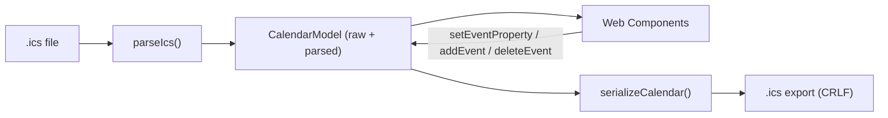
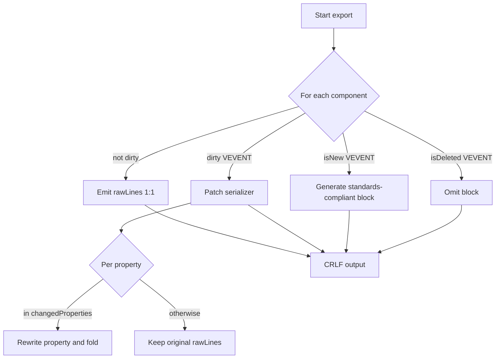

# Architecture

## Guiding principle: raw + patch

No full roundtrip through a calendar library. Every component is stored **twice**:

- as `rawLines` (untouched original lines), and
- as `parsed` (interpreted, editable view).

When exporting, the rule is: **unchanged = emit original lines; changed = patch only
the affected properties**. ICAL.js is used at most as an optional helper
(recurrence expansion, time zones), never as the export path.

### Why not the classic roundtrip?

A full path `ICS -> library model -> regeneration` can change or remove unknown
`X-*` properties, property order, parameters, HTML in `X-ALT-DESC`, multiple
`VALARM` blocks, special `VTIMEZONE` data, and formatting/folding.

## Data model

Defined in `src/model/types.ts`.

```ts
interface ContentLine {
  name: string;
  parameters: Record<string, string[]>;
  parameterOrder: string[];   // preserves the original parameter order
  value: string;
  rawLines: string[];         // original physical lines (including folding)
}

interface Component {
  kind: string;               // VCALENDAR | VEVENT | VALARM | VTIMEZONE | ...
  rawLines: string[];         // exact original lines including BEGIN/END
  properties: ContentLine[];
  children: Component[];
  dirty: boolean;             // false => emit rawLines 1:1
}

interface VEvent {
  component: Component;        // raw access (source of truth for export)
  parsed: ParsedEvent;         // interpreted view for the UI
  changedProperties: Set<string>;
  isNew: boolean;
  isDeleted: boolean;
}
```

The `CalendarModel` (`src/model/types.ts`) stores the `VCALENDAR` tree, an index of
editable events, the line ending detected during import (`originalEol`), and whether
the file ended with a trailing line break.

The invariant that makes Keepical loss-minimizing is: **if a component is not
`dirty`, it is serialized unchanged from `rawLines`.**

## Data flow



## Export strategy (the heart of loss minimization)

Implemented in `src/export/patch.ts`.



The order of unchanged properties is preserved; only changed properties are replaced
at their previous position, and new ones are appended to the end of the component.

## Event behavior

See `src/model/calendar.ts`.

- **Existing:** UID unchanged; DTSTAMP rule applied; LAST-MODIFIED can be updated;
  SEQUENCE can be incremented; untouched/unknown properties and alarms remain.
- **New:** `UID:<uuid>@keepical.local` (suffix configurable via
  `DEFAULT_UID_SUFFIX`), minimum fields UID/DTSTAMP/DTSTART/DTEND|DURATION/SUMMARY.
- **Deleted:** the entire `VEVENT` block is removed and nothing else.

## Technical stack

- TypeScript, Vite (build + dev server), Vitest (tests)
- UI with native Web Components (custom elements), no framework
- CSS without a preprocessor
- File System Access API with `FileReader` fallback; download via Blob
- Target hosting: GitHub Pages (static, `base` configured in `vite.config.ts`)

Continue to [Parser](Parser.md).
