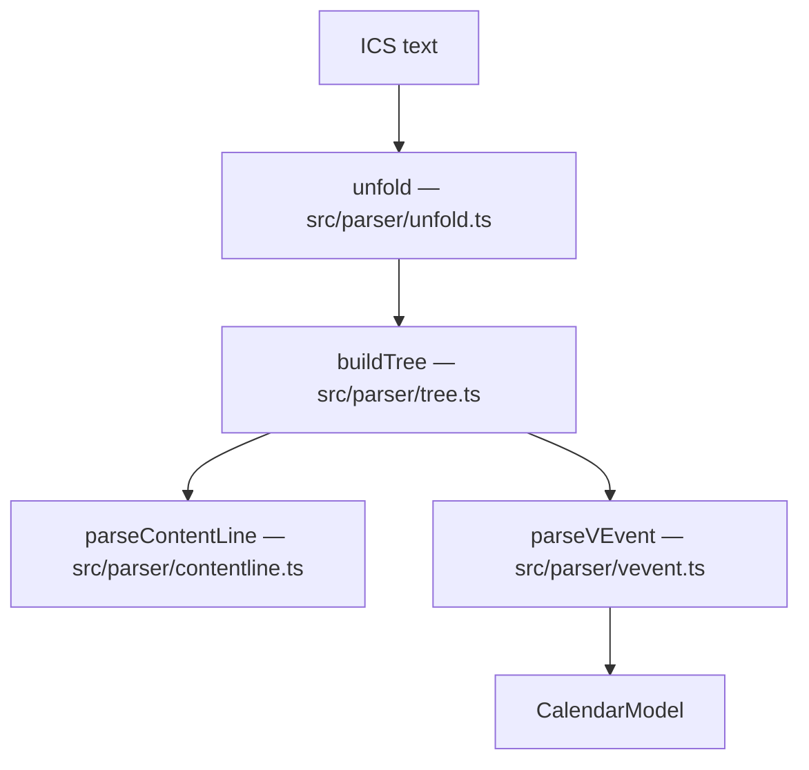

# Parser

The parser turns ICS text into a `CalendarModel` while preserving all raw data.
Entry point: `parseIcs()` in `src/parser/index.ts`.

## 1. Line endings and unfolding — `src/parser/unfold.ts`

- **Import accepts** CRLF, LF, and lone CR. The dominant line ending is detected
  (`eol`) and reused during export (default: CRLF).
- **Unfolding:** A physical line that starts with a space or tab is a continuation
  of the previous logical line; exactly **one** leading character is removed
  (RFC 5545).
- **Important for loss minimization:** In addition to the logical lines, the
  physical lines are preserved. Every logical line tracks the physical lines it
  came from through `physicalIndices`.

## 2. ContentLine split — `src/parser/contentline.ts`

A property has the form `NAME;PARAM=VALUE:PROPERTY-VALUE`. The parser does not split
naively on `;` or `:` because parameter values can be quoted and may contain those
characters. Instead, it uses a small state machine (name -> parameters with
quoted/multi-value content -> value). Covered by `test/parser.test.ts`.

## 3. Component tree — `src/parser/tree.ts`

`BEGIN:X` / `END:X` create components. Every component stores its exact original
lines (including BEGIN/END and folding). Unknown components (for example `VTODO`,
`VJOURNAL`, `VFREEBUSY`) are preserved as generic `Component` nodes.

## 4. VEVENT interpretation — `src/parser/vevent.ts`

`parseVEvent()` reads known properties into the `parsed` view without mutating or
discarding anything. All remaining properties stay accessible through
`component.properties` / `component.rawLines`. Date/time values are interpreted as
`DateTimeValue` (`raw`, `isDate`, `isUtc`, `tzid`).

Continue to [Export & Validation](Export-and-Validation.md).
