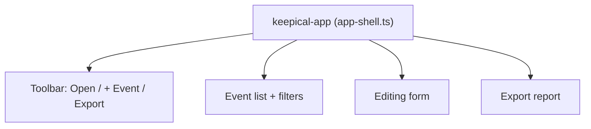

# UI

The interface is implemented without a framework, using native Web Components.
Currently all MVP interactivity lives in a single `keepical-app` component
(`src/ui/app-shell.ts`), registered through `src/main.ts`. Styles are in
`src/styles/app.css` (including dark mode via `prefers-color-scheme`).

## Structure

## Event list

Shows date/time, title, recurrence (↻) and alarm (⏰) icons, plus a change indicator.
Filters: search (title/location), changed only, recurring only, events with alarms.

## Editing form

Standard fields: SUMMARY, DTSTART, DTEND, LOCATION, DESCRIPTION. Advanced sections
(collapsible): a hybrid RRULE editor (`FREQ`, `INTERVAL`, `COUNT`, `UNTIL`,
`BYDAY`, `BYMONTHDAY`, `BYSETPOS`) with always-visible raw fallback, EXDATE, plus
a raw-data view of all properties. The UID is shown as **read-only**.

Changes go through `setEventProperty()` (`src/model/calendar.ts`), which marks the
affected property in `changedProperties` and sets the component to `dirty` — the
basis for selective patch export.

## New / delete

`+ Event` creates a standards-compliant `VEVENT` with a new UID via `addEvent()`
(`@keepical.local`). Deleting marks the event via `deleteEvent()`; on export, only
that block disappears.

## Export

Before download, `validate()` runs and prompts on errors. Then
`serializeCalendar()` creates the Blob download, followed by the report from
`buildReport()`.

## Outlook

The individual components outlined in the plan (`event-list`, `event-editor`,
`rrule-editor`, `export-report`) can be extracted from `app-shell` as complexity
increases. See [Roadmap](Roadmap.md).

Continue to [Testing](Testing.md).
